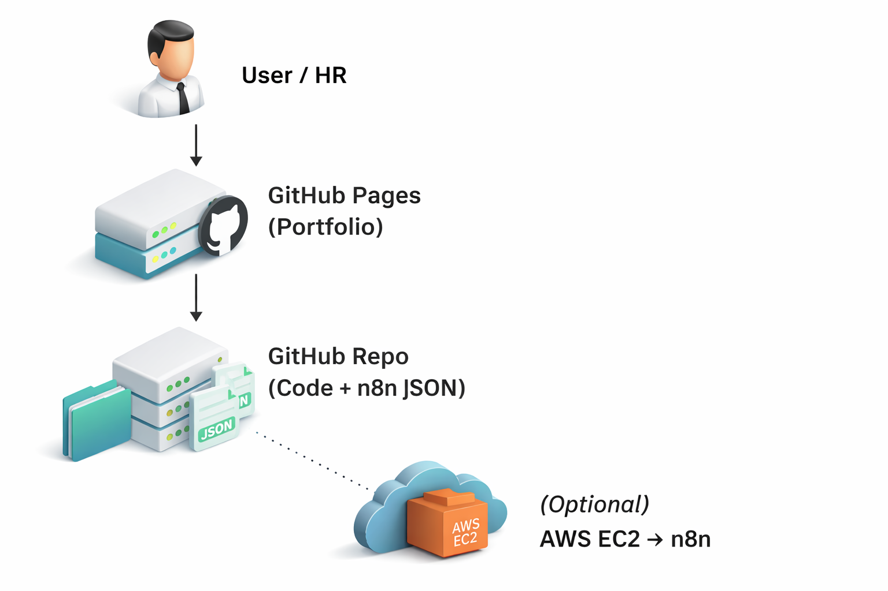

# devops-portfolio-project
---

## 🔄 DevOps Automation (n8n)

I have designed DevOps automation workflows using **n8n** to demonstrate
event-driven CI/CD alerts, infrastructure monitoring, and DevSecOps security gates.

### Automations Included
- CI/CD Alert Automation
- Infrastructure Health Monitoring
- DevSecOps Security Gate

🔗 **Live Automation Portfolio (Always Live):**  
https://sanmugam1992.github.io/devops-n8n-portfolio/

> Note: Workflows are version-controlled and can be deployed on demand.

---

## 🏗️ Architecture Diagram

### Flow Explanation
- HR/User accesses the portfolio via GitHub Pages
- Portfolio links to GitHub repositories containing code and n8n workflows
- n8n automations can be deployed on AWS EC2 when required

